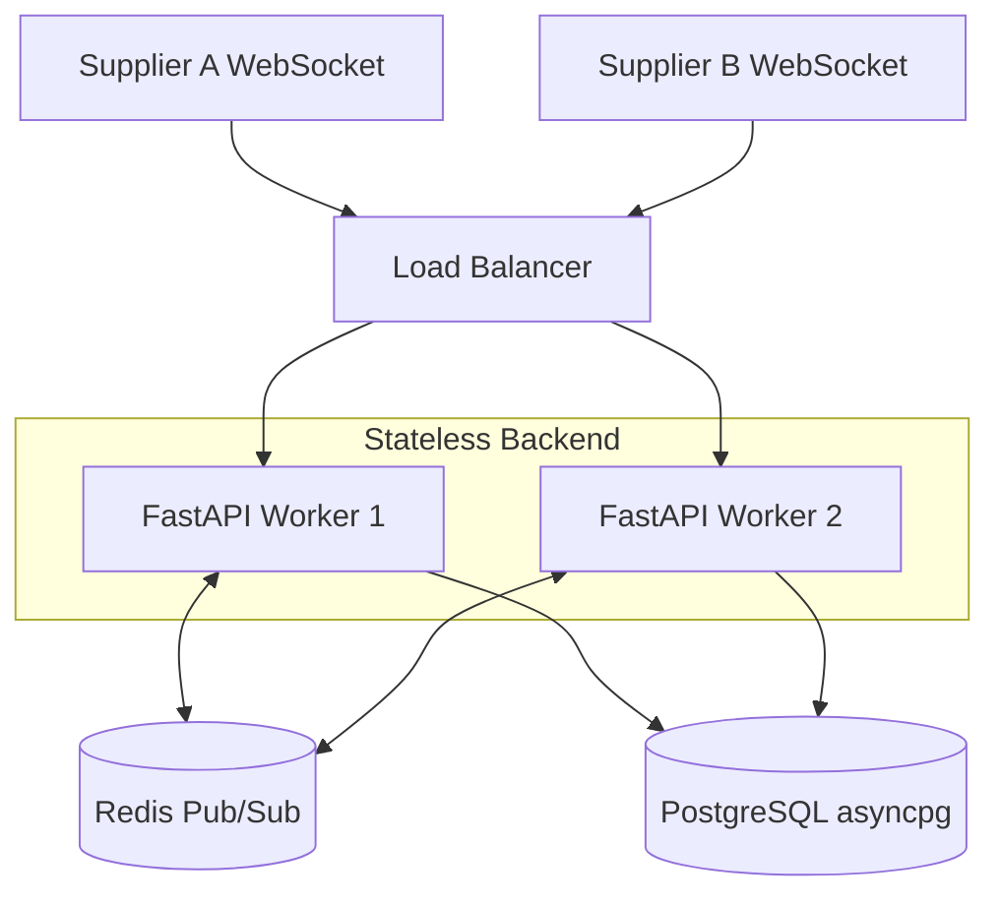
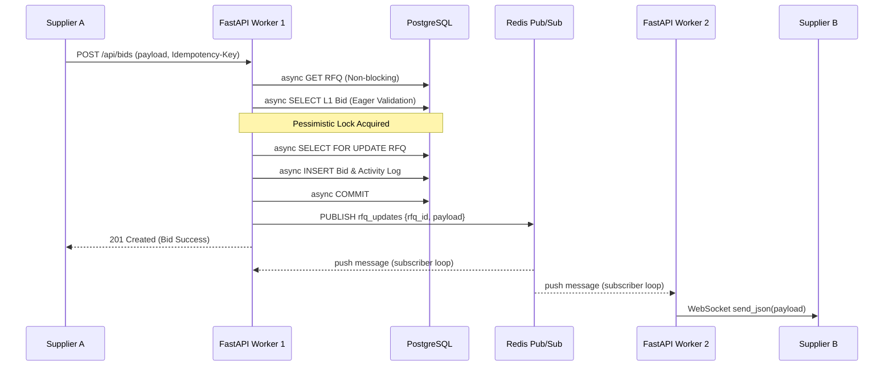

# [Assignment] British Auction in RFQ System

2 ~~.~~ Problem Statement

3 ~~.~~ Product Goals & Business Objectives

4 ~~.~~ Success Metrics

5 ~~.~~ Core Functional Requirements

6 ~~.~~ British Auction Configuration Options

~~7.~~ Validation Rules

8 ~~.~~ Auction Listing & Details Pages

What is an RFQ?

An RFQ (Request for Quotation) is a process where a buyer asks multiple suppliers to submit

quotes for providing a service or product ~~.~~ Suppliers compete with each other by offering better

prices and terms, and the buyer selects the most suitable quote ~~.~~

What is a British Auction?

A British Auction (in this context) is a competitive bidding process where:

Suppliers submit bids openly ~~.~~

Suppliers can continuously lower their prices to beat competitors ~~.~~

If bidding activity happens close to the auction end time, the auction is automatically

The auction has a forced close time, after which bidding must stop no matter what ~~.~~

This approach prevents last ~~-~~ second bidding and encourages fair competition ~~.~~

2 ~~.~~ Problem Statement

Design and build a simplified RFQ system that supports British Auction ~~–s~~ tyle bidding,

Automatic bid time extensions

Forced close rules

Configurable auction behavior

Clear visibility of auction progress

---

3 ~~.~~ Product Goals & Business Objectives

Enable transparent and fair supplier competition

Prevent last minute bidding manipulation

Encourage active participation from suppliers

Help buyers achieve better final pricing

4 ~~.~~ Success Metrics

Increase in number of bids per RFQ

Improved final prices compared to non extended auctions

5 ~~.~~ Core Functional Requirements

RFQ Creation

Users should be able to create an RFQ with the British Auction option enabled ~~.~~

Key fields in the RFQ creation form:

RFQ Name / Reference ID

Bid Start Date & Time

Bid Close Date & Time

Forced Bid Close Date & Time (must be later than Bid Close Time)

Pickup / Service Date

Example fields present in Quote Submission form for a RFQ:

Carrier Name

Freight charges, Origin charges, destination charges

Transit Time

Validity of Quote

# Rule: The auction must never extend beyond the Forced Bid Close Time .

6 ~~.~~ British Auction Configuration Options

These configurations control when and how the auction time is extended ~~.~~

---

6 ~~.1~~ Trigger Window (X Minutes)

Defines how close to the auction end the system should monitor bidding activity ~~.~~

Bid Close Time: 6:00 PM

Trigger Window (X): 10 minutes

~~–~~

The system monitors activity between 5:50 PM 6:00 PM

6 ~~.~~ 2 Extension Duration (Y Minutes)

Defines how much extra time should be added when a trigger condition occurs ~~.~~

Extension Duration (Y): 5 minutes

If triggered, Bid Close Time extends from 6:00 PM → 6:05 PM

6 ~~.~~ 3 Extension Triggers

Defines what type of activity should cause the auction to extend ~~.~~

a) Bid Received in Last X Minutes

in

If any supplier submits a new bid during the trigger window, the auction extends ~~.~~

Trigger Window: 10 minutes

A bid is placed at 5:55 PM

Auction extends by Y minutes

If any change in supplier ranking occurs during the trigger window, the auction extends ~~.~~

Supplier B underbids Supplier A at 5:58 PM

Rankings change

Auction extends by Y minutes

---

c) Lowest Bidder (L1) Rank Change in Last X Minutes

The auction extends only when the lowest ~~-~~ priced supplier changes ~~.~~

Supplier C becomes the new lowest bidder at 5:59 PM

Auction extends by Y minutes

~~7.~~ Validation Rules

Forced Bid Close Time must always be greater than Bid Close Time

Auction extensions must never exceed the Forced Bid Close Time

8 ~~.~~ Auction Listing & Details Pages

Auction Listing Page

Show a list of all British Auctions with:

RFQ Name / ID

Current Lowest Bid

Current Bid Close Time

Forced Close Time

Auction Status (Active / Closed / Force Closed)

Auction Details Page

For a selected RFQ, display:

All supplier bids (sorted by price)

Supplier ranking (L1, L2, L3, ~~...~~ )

Details of the submitted quote like charges, quote validity …

Auction configuration (X and Y values)

Activity log showing:

Reason for each extension

---

You have to submit the following:

Simple HLD with architecture diagram

Schema Design for database tables

Backend Code

Frontend Code

Good luck and happy hacking!

---

## High Level Architecture & Sequence Diagrams

### System Architecture

### Bidding & Redis Pub/Sub Sequence Flow

