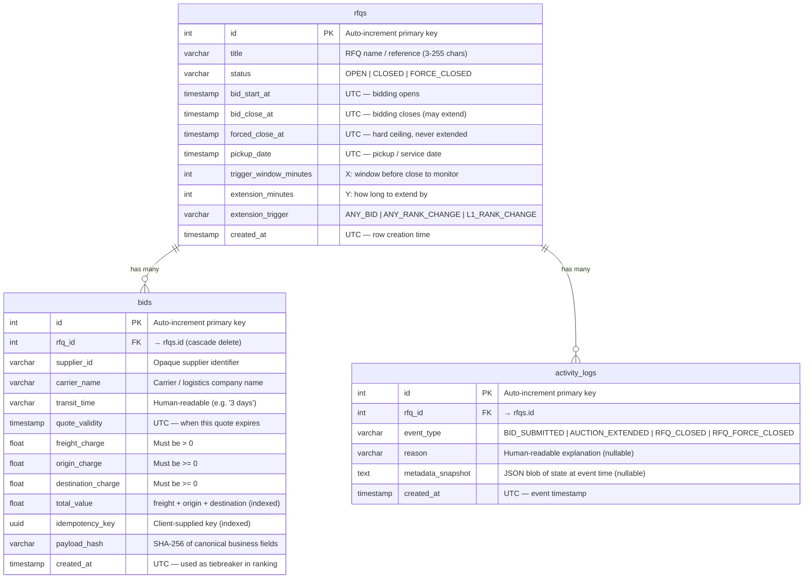

  <a href="./README.md">README</a> &nbsp;|&nbsp; 
  <a href="./System%20Architecture.md">System Architecture</a> &nbsp;|&nbsp; 
  <a href="./Sequence%20Diagram.md">Sequence Diagram</a> &nbsp;|&nbsp;
  <a href="./Stress%20Test%20Results.md">Stress Test Results</a> &nbsp;|&nbsp;
  <strong>Schema Design</strong>

 

# Schema Design

This document describes the PostgreSQL schema used by BritishRFQ — every table, column, constraint, and the relationships between them.

---

## Entity Relationship Diagram

---

## Table: `rfqs`

Stores one row per Request for Quotation. The row is mutable — `bid_close_at` is updated in-place when an auction extension is triggered, and `status` transitions from `OPEN` → `CLOSED` or `FORCE_CLOSED`.

| Column | Type | Constraints | Description |
|--------|------|-------------|-------------|
| `id` | `INTEGER` | PK, auto-increment | Surrogate primary key |
| `title` | `VARCHAR` | NOT NULL, length 3–255 | Human-readable RFQ name / reference |
| `status` | `VARCHAR` | NOT NULL, DEFAULT `'OPEN'`, indexed | Lifecycle state: `OPEN`, `CLOSED`, or `FORCE_CLOSED` |
| `bid_start_at` | `TIMESTAMP` | NOT NULL | UTC — when suppliers may start bidding |
| `bid_close_at` | `TIMESTAMP` | NOT NULL | UTC — current bidding deadline (updated on extensions) |
| `forced_close_at` | `TIMESTAMP` | NOT NULL | UTC — absolute ceiling; `bid_close_at` is always ≤ this value |
| `pickup_date` | `TIMESTAMP` | NOT NULL | UTC — requested pickup / service date |
| `trigger_window_minutes` | `INTEGER` | NOT NULL, ≥ 0 | X: bids inside `(bid_close_at - X minutes, bid_close_at]` may trigger extension |
| `extension_minutes` | `INTEGER` | NOT NULL, ≥ 0 | Y: `new_close = bid_close_at + Y`, clamped to `forced_close_at` |
| `extension_trigger` | `VARCHAR` | NOT NULL | One of `ANY_BID`, `ANY_RANK_CHANGE`, `L1_RANK_CHANGE` |
| `created_at` | `TIMESTAMP` | NOT NULL, DEFAULT `now()` | Row creation time (UTC, naive) |

**Validation invariants (enforced at the application layer):**
- `bid_start_at < bid_close_at`
- `bid_close_at < forced_close_at`

---

## Table: `bids`

Stores every bid submission. Multiple bids per supplier per RFQ are permitted (a supplier can improve their own position). The **leaderboard** is computed at query time by aggregating the minimum `total_value` per `supplier_id`.

| Column | Type | Constraints | Description |
|--------|------|-------------|-------------|
| `id` | `INTEGER` | PK, auto-increment | Surrogate primary key |
| `rfq_id` | `INTEGER` | FK → `rfqs.id`, NOT NULL, indexed, cascade delete | Parent RFQ |
| `supplier_id` | `VARCHAR` | NOT NULL, indexed | Opaque identifier for the submitting supplier |
| `carrier_name` | `VARCHAR` | NOT NULL | Name of the carrier / logistics provider |
| `transit_time` | `VARCHAR` | NOT NULL | Human-readable transit duration (e.g. `"3 days"`) |
| `quote_validity` | `TIMESTAMP` | NOT NULL | UTC — date until which this quote is valid |
| `freight_charge` | `FLOAT` | NOT NULL, > 0 | Main freight cost |
| `origin_charge` | `FLOAT` | NOT NULL, ≥ 0 | Origin port / pickup surcharge |
| `destination_charge` | `FLOAT` | NOT NULL, ≥ 0 | Destination port / delivery surcharge |
| `total_value` | `FLOAT` | NOT NULL, indexed | Computed: `freight + origin + destination` — the ranking key |
| `idempotency_key` | `UUID` | NOT NULL, indexed | Client-supplied deduplication key |
| `payload_hash` | `VARCHAR` | NOT NULL | SHA-256 of canonical business fields; used to detect same-key / different-payload conflicts |
| `created_at` | `TIMESTAMP` | NOT NULL, DEFAULT `now()`, indexed | UTC submission time; secondary sort key for tiebreaking |

**Unique constraint:** `(supplier_id, idempotency_key)` — enforces that one supplier cannot reuse the same idempotency key for a different bid (DB-level race-condition guard).

---

## Table: `activity_logs`

Append-only audit trail. One row per significant auction event. Never updated after insert.

| Column | Type | Constraints | Description |
|--------|------|-------------|-------------|
| `id` | `INTEGER` | PK, auto-increment | Surrogate primary key |
| `rfq_id` | `INTEGER` | FK → `rfqs.id`, NOT NULL, indexed | Parent RFQ |
| `event_type` | `VARCHAR` | NOT NULL, indexed | One of the four event types below |
| `reason` | `VARCHAR` | nullable | Human-readable explanation of why the event occurred |
| `metadata_snapshot` | `TEXT` | nullable | JSON blob capturing state at event time (e.g. `{"old_close": "...", "new_close": "..."}`) |
| `created_at` | `TIMESTAMP` | NOT NULL, DEFAULT `now()` | UTC — used to order the activity feed |

**Event types:**

| `event_type` | Trigger | Example `reason` |
|---|---|---|
| `BID_SUBMITTED` | A bid is successfully inserted | *(stored in metadata_snapshot instead)* |
| `AUCTION_EXTENDED` | Extension engine fires | `"L1 (Lowest Bidder) changed within trigger window"` |
| `RFQ_CLOSED` | `bid_close_at` reached, no extension pending | `"Bid close time reached with no further extensions"` |
| `RFQ_FORCE_CLOSED` | `forced_close_at` reached | `"Forced close time reached"` |

---

## Key Design Decisions

### Naive UTC timestamps
All `TIMESTAMP` columns store **naive UTC** (no timezone offset). The application layer normalises all inputs to UTC-naive via a Pydantic `field_validator` before writing to the database, and treats all reads as UTC. This avoids PostgreSQL `TIMESTAMPTZ` vs `TIMESTAMP` comparison errors while keeping the schema simple.

### Per-supplier leaderboard (computed at query time)
The leaderboard is not materialised — it is computed on every `GET /rfqs/{id}` call using a `GROUP BY supplier_id / MIN(total_value)` subquery joined back to the `bids` table. This keeps the write path simple and avoids consistency issues from a denormalised rank column.

### Pessimistic locking (`SELECT ... FOR UPDATE`)
The `rfqs` row is locked for the duration of the bid-insert + extension-evaluate + log-write transaction. This prevents two concurrent bids from computing their rank change decisions on stale state and producing a split-brain extension.
