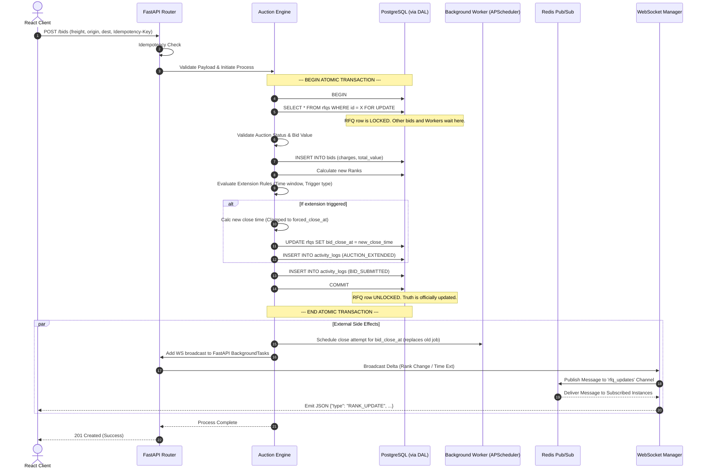

  <a href="./README.md">README</a> &nbsp;|&nbsp; 
  <a href="./System%20Architecture.md">System Architecture</a> &nbsp;|&nbsp; 
  <strong>Sequence Diagram</strong> &nbsp;|&nbsp;
  <a href="./Schema%20Design.md">Schema Design</a> &nbsp;|&nbsp;
  <a href="./Stress%20Test%20Results.md">Stress Test Results</a>

 

# Sequence Diagram

