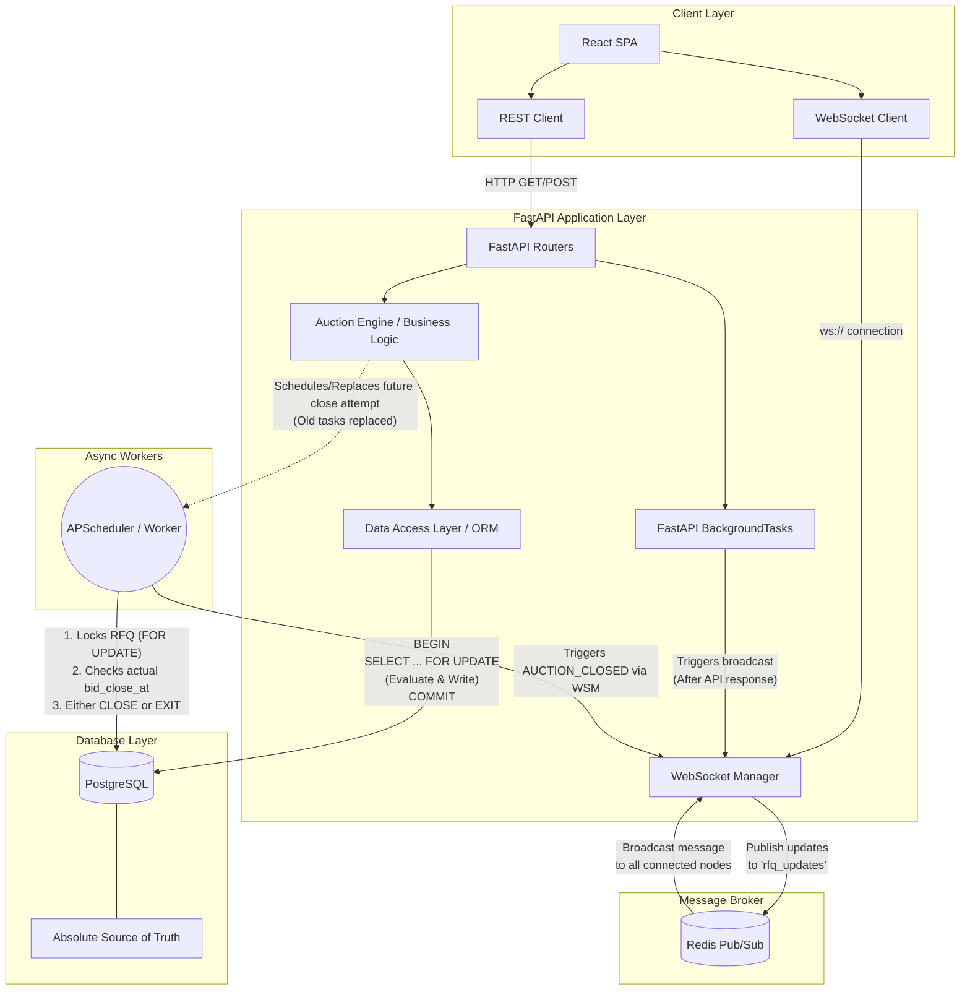

# System Architecture

```mermaid
graph TD
    %% Client Layer
    subgraph Client Layer
        R[React SPA]
        REST_C[REST Client]
        WS_C[WebSocket Client]
        R --> REST_C
        R --> WS_C
    end

    %% Application Layer (FastAPI)
    subgraph FastAPI Application Layer
        API[FastAPI Routers]
        WSM[WebSocket Manager]
        AE[Auction Engine / Business Logic]
        DAL[Data Access Layer / ORM]
        BT[FastAPI BackgroundTasks]
        
        REST_C -- HTTP GET/POST --> API
        WS_C -- ws:// connection --> WSM
        
        API --> AE
        API --> BT
        AE --> DAL
        BT -- "Triggers broadcast\n(After API response)" --> WSM
    end

    %% Message Broker
    subgraph Message Broker
        Redis[(Redis Pub/Sub)]
    end

    %% Database Layer (The Source of Truth)
    subgraph Database Layer
        DB[(PostgreSQL)]
        Note_DB[Absolute Source of Truth]
        DB --- Note_DB
    end

    %% Background Jobs (The "Dumb" Worker)
    subgraph Async Workers
        BW((APScheduler / Worker))
    end

    %% Connections & Flow
    DAL -- "BEGIN\nSELECT ... FOR UPDATE\n(Evaluate & Write)\nCOMMIT" --> DB
    WSM -- "Publish updates\nto 'rfq_updates'" --> Redis
    Redis -- "Broadcast message\nto all connected nodes" --> WSM
    
    %% Worker Flow
    AE -. "Schedules/Replaces future close attempt\n(Old tasks replaced)" .-> BW
    BW -- "1. Locks RFQ (FOR UPDATE)\n2. Checks actual bid_close_at\n3. Either CLOSE or EXIT" --> DB
    BW -- "Triggers AUCTION_CLOSED via WSM" --> WSM
```
